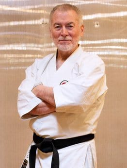

## WTKO EXECUTIVE CHAIRMAN

### John J. Mullin Sensei (9th Dan)

Sensei Mullin began his karate training in 1960. He was a member of the JKA/ITKF US National Team for 5 years, from 1980 through 1984, and a former US Open National Champion. 
In 1985, while living and training in Japan, he won the All Styles Karate Championship in Yokohama. 
In 1994 he was recognized as “Instructor of The Year” by The Karate Voice a national karate publication. 
In 2002 he won the JSKA World Championship, in Germany, veterans kata division.

He is a member of the faculty of the Karate Instructor Certificate Program at Long Island University, New York. He is also a contributing author in Karate Martial Art and Sport along with Milorad V. Stricevic, M.D. Associate Dean, School of Health Professions. 

Sensei Mullin was the Chief Instructor of the JKA Karate Staten Island and was awarded “A” class Certified Instructor in the JKA Shotokan Karate-do America, the governing body for JKA karate in the United States. 

After a 42 year career in the JKA, Sensei Mullin decided on a new direction; along with a number of senior instructors founded the World Traditional Karate Organization (WTKO).

