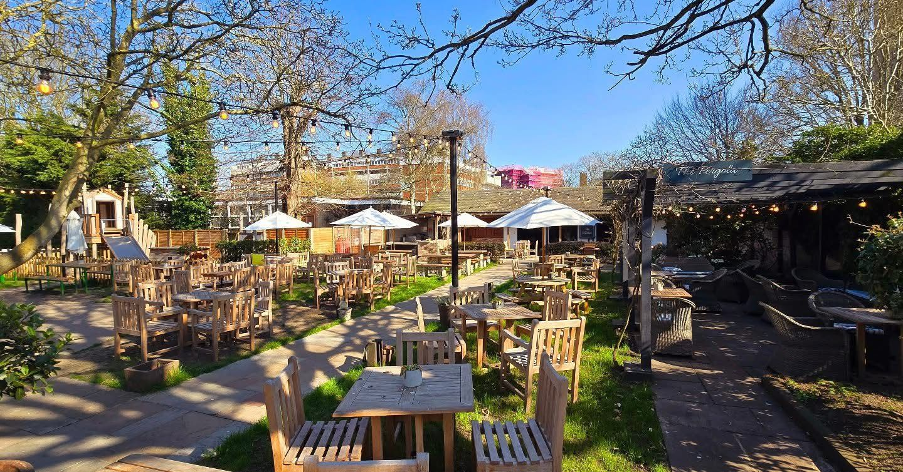

# Informal Pre Camp Meet and Greet - Wednesday 30th July 2025

**Venue website:** [www.thegeorgiantownhousenorwich.com](https://www.thegeorgiantownhousenorwich.com)

**GoogleMaps:** [https://maps.app.goo.gl/aRnX4p3qBnJXYtNF9](https://maps.app.goo.gl/aRnX4p3qBnJXYtNF9?g_st=com.google.maps.preview.copy)

Whilst the 2025 WTKO Summer Camp is focussed on 4 days of intense training led by some of the world’s best instructors, it is also a chance to catch up with old friends - and make new ones - who all share the same passion.

Prior to the formal start of the camp, myself and members of the host club - Shotokan Katate Norwich - will be at a local pub from 6pm onwards. The venue is only a couple of miles from the UEA Sports Park; The Georgian Town House also offers food for anybody wishing to eat. 
No need to prebook if you are planning to pop in for a drink, but if you are planning to eat it is advisable to book a table via the pub’s website. 

Would be lovely to catch up with you if you’re able to make it. 

Hopefully see you soon. 

*Dan*


