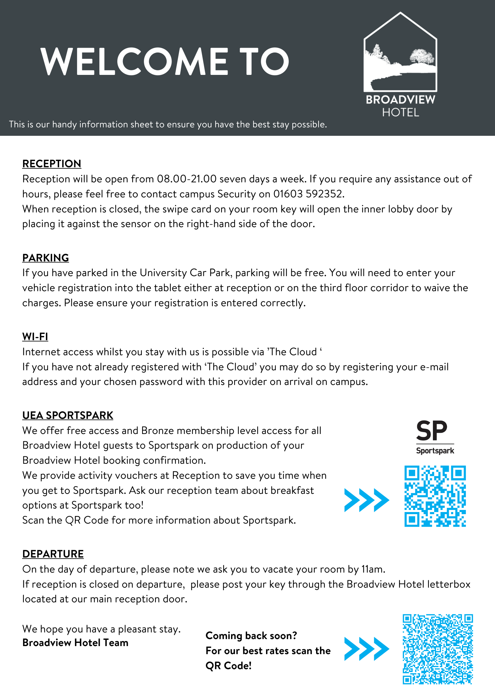

### Barton Rooms

> PLEASE NOTE ROOMS ARE ONLY RESERVED UNTIL 28th FEBRUARY 2025

The Barton rooms have been agreed with you for £50 per night for single occupancy only. 

These include:
- A single bed in a dorm style room
- Private ensuite bathroom
- Access to a shared kitchen between other conference guests
- Free Parking
- Free Wi-Fi

There is also the option of adding on breakfast for your stay. Breakfast is set at £9.50 per person per day and includes a build your own cooked breakfast at Zest, which is one of our popular catering facilities.
 
To book into one of the reserved spaces, please contact reception by telephone on 01603 591918 or email us at [Broadviewhotel@uea.ac.uk](mailto:Broadviewhotel@uea.ac.uk). 

Reception is open 8am – 9pm Monday – Sunday. You will be asked to confirm the below information:
 
- Name(s)
- Arrival Date
- Number of Nights
- Number of single rooms
- Breakfast required (number of breakfasts)
 
Please note: Rooms will be allocated into shared flats so you will be sharing a kitchen with other Summer Camp individuals. Flats are made up of 6-12 ensuite rooms. For anyone wanting to share a flat with specific individuals please let us know.
 
You will be asked to pay using a credit or debit card over the phone in full to confirm the booking.



We look forward to welcoming you to *Broadview Hotel*, where we hope you have a pleasant stay with us.    

## Location
You are staying in one of our single en suite rooms in Barton House.

**Address:** 
Barton House 
University of East Anglia 
Norwich 
NR4 7TJ  

[Click here for a map of our location](https://www.google.com/maps/place/Barton+House/@52.6242998,1.2441972,17z/data=!3m1!4b1!4m5!3m4!1s0x47d9e124dee67d3d:0x87ec9dc94703c96f!8m2!3d52.6242966!4d1.2463859)

## Checking In
Check-in is from **15:00** via Broadview Hotel reception.  
Reception is open from **08:00 to 21:00**, seven days a week.
 
If you arrive outside these hours, please check in at the **24-hour Security Control Room**.  
[Click here for a map of their location](https://goo.gl/maps/FebtJXmenKQurwTz5)  
Contact number: **01603 592352**

## Checking Out
Check-out is at **11:00** on the day of your departure.  
Please ensure you return your keys to Broadview Hotel reception.