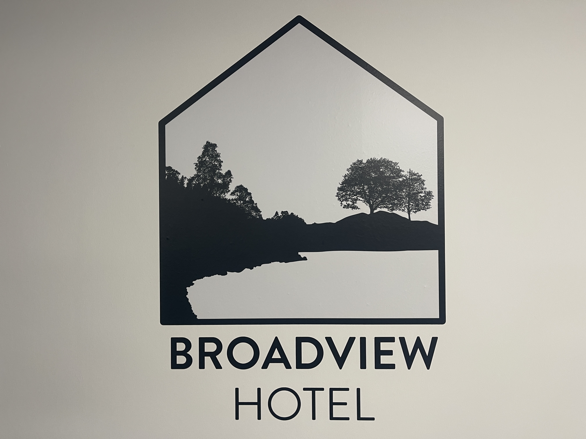

### The Broadview Hotel

> PLEASE NOTE ROOMS ARE ONLY RESERVED UNTIL 28th FEBRUARY 2025

The Broadview Hotel offers on-campus accommodation just a 3-minute walk from the training venue.

**Website:** [uea.ac.uk/about/information-for-visitors/visitor-accommodation](https://www.uea.ac.uk/about/information-for-visitors/visitor-accommodation)

The hotel offers both double and twin rooms.

### Double Rooms
The double rooms have been agreed for £65 per night for single occupancy or £75 for double occupancy. 

These include:
- Double bed
- Private ensuite bathroom
- TV in room
- Tea and coffee making facilities
- Free parking
- Free Wi-Fi
 
### Twin Rooms
The twin rooms have been agreed with for £65 per night for single occupancy or £75 for double occupancy. 

These include:
- Two single beds
- Private ensuite bathroom
- TV in room
- Tea and coffee making facilities
- Free Parking
- Free Wi-Fi

### The Family Suite ❌ **Sold Out**  
The family suite has been agreed with for £160 per night and fits 4 guests.  

The Family Suite includes:
- One double room
- One twin room
- Private bathroom
- TV in room
- Tea and coffee making facilities
- Free Parking
- Free Wi-Fi

> **Sold Out** There is only one family suite available, so it will be allocated on a first-come, first-served basis.

### The Family Room ❌ **Sold Out**  
The family room has been agreed with for £110 per night and fits 3 guests.  

The Family Room includes:
- One double bed
- One single bed
- Private ensuite bathroom
- TV in room
- Tea and coffee making facilities
- Free Parking
- Free Wi-Fi

> **Sold Out** There is only one family room available, so it will be allocated on a first-come, first-served basis.

### Studio Flats
The studio flats has been agreed with for £110 per night and fit 2 guests. These are designed for guests who prefer self-catering and value having a private space.

The Family Suite includes:
- One double room
- One room with a living area with a small kitchenette
- Private bathroom
- TV in room
- Tea and coffee making facilities
- Free Parking
- Free Wi-Fi

> There are only two studio flats available, so they will be allocated on a first-come, first-served basis.

### Optional breakfast
There is also the option of adding on breakfast for your stay. Breakfast is set at £9.50 per person per day and includes a build your own cooked breakfast at Zest, which is one of our popular catering facilities.

### Booking
To book into one of the reserved spaces, please contact reception by telephone on +44 01603 591918 or email us at [Broadviewhotel@uea.ac.uk](mailto:Broadviewhotel@uea.ac.uk). 

Reception is open 8am – 9pm Monday – Sunday. You will be asked to confirm the below information:

- Name(s)
- Arrival Date
- Number of Nights
- Number of Twin / Double Rooms
- Breakfast required (number of breakfasts)
 
 
You will be asked to pay using a credit or debit card over the phone in full to confirm the booking.

