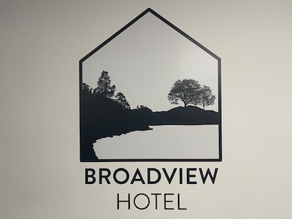

### The Broadview Hotel

The Broadview Hotel offers on-campus accommodation just a 3-minute walk from the training venue.

**Website:** [uea.ac.uk/about/information-for-visitors/visitor-accommodation](https://www.uea.ac.uk/about/information-for-visitors/visitor-accommodation)

The hotel offers both double and twin rooms.

### Double Rooms
The double rooms have been agreed for £65 per night for single occupancy or £75 for double occupancy. 

These include:
- Double bed
- Private ensuite bathroom
- TV in room
- Tea and coffee making facilities
- Free parking
- Free wifi
 
### Twin Rooms
The twin rooms have been agreed with for £65 per night for single occupancy or £75 for double occupancy. 

These include:
- Two single beds
- Private ensuite bathroom
- TV in room
- Tea and coffee making facilities
- Free Parking
- Free Wifi

