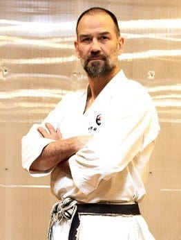

## WTKO CHIEF INSTRUCTOR

### Richard Amos Sensei (8th Dan)

Born in England in 1963, Richard Amos sensei began karate at the age of 10. Occasionally teaching from as young as 15, he was invited onto the KUGB Junior National Karate Team when he 18 years old. By the age of 23 he had competed for England all over Europe gaining many Gold, Silver and Bronze medals in numerous championships. After a brief spell in New York from 1986 to 1988, he then went to Japan to train at the headquarters of the Japan Karate Association. He stayed 10 years. During that time he completed the 3-year JKA Instructors Program, being only the second Westerner ever to do so in its 50-year history. He placed second or third in the All-Japan Championships several times during a period when no non-Japanese had ever reached the semi-finals. He taught regular classes each week over a 6-year period in the headquarters of the JKA (another first) and opened his own school in the heart of Tokyo. 

In 2000 Amos sensei returned to New York, this time as an established professional karate instructor with an international reputation.

Amos sensei is currently the Chief Instructor of the World Traditional Karate Organization heading its Kenshusei Instructor Program and teaching private and group classes every day at the Honbu dojo on 340E 71st Street, New York. A highly sought after instructor, he travels overseas regularly, teaching at events and WTKO dojos all over the world.
