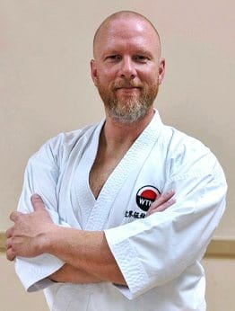

## WTKO INTERNATIONAL DIRECTOR

### Scott Middleton Sensei (7th Dan)

Scott Middleton has been a member of the WTKO Executive Committee since 2011, and holds the position of WTKO International Director. In his duties as International Director Scott frequently liaises with global affiliates to assist in the international promotion and development of the WTKO.

As a practitioner, Scott began studying Shotokan as a young adolescent, and has continued to passionately pursue a higher level of karate. Currently Scott has the rank of 7th Degree Black Belt, and is a Level A / Graduate of the WTKO Instructor Program.