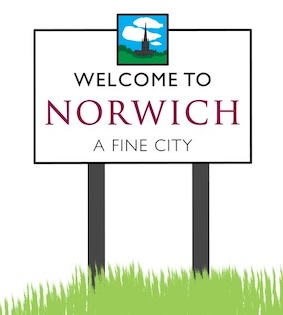

# Travel Arrangements for UEA

The University of East Anglia (UEA) offers a comprehensive guide to help you with your local travel needs. For detailed information, visit the [Travel and Transport page](https://www.uea.ac.uk/uea-life/campus-life/travel-and-transport) on the UEA website.

## 🛫 Airports

### Norwich Airport
- **Website:** [norwichairport.co.uk](https://www.norwichairport.co.uk/)  
- **Distance from UEA:** 4.1 miles (12-minute drive)

### London Stansted Airport
- **Website:** [stanstedairport.com](https://www.stanstedairport.com/)  
- **Distance from UEA:** 82 miles (90-minute drive)

## 🚆 Train Station

- **Website:** [greateranglia.co.uk](https://www.greateranglia.co.uk/)  
- **Distance from UEA:** 4.1 miles (14-minute drive)

## 🚌 Buses

### 🚍 Local Buses
Explore bus routes around Norwich and find ticket information below:  
- **Website:** [firstbus.co.uk](https://www.firstbus.co.uk/norfolk-suffolk/routes-and-maps/network-norwich)

### 🏙️ National Buses
For travel beyond Norwich, national bus services are available:
- **National Express** – Offers routes across the UK, including direct services to London and other major cities.  
  - **Website:** [nationalexpress.com](https://www.nationalexpress.com/)  
- **Megabus** – Provides budget-friendly travel to various destinations around the country.  
  - **Website:** [uk.megabus.com](https://uk.megabus.com/)

## 🚖 Taxis

Recommended taxi services in Norwich:
- [ABC Taxis Norwich](https://www.abctaxisnorwich.co.uk/)
- [Courtesy Taxis](https://courtesytaxis.com/)
- [Gold Star Taxis](https://goldstartaxis.org/)