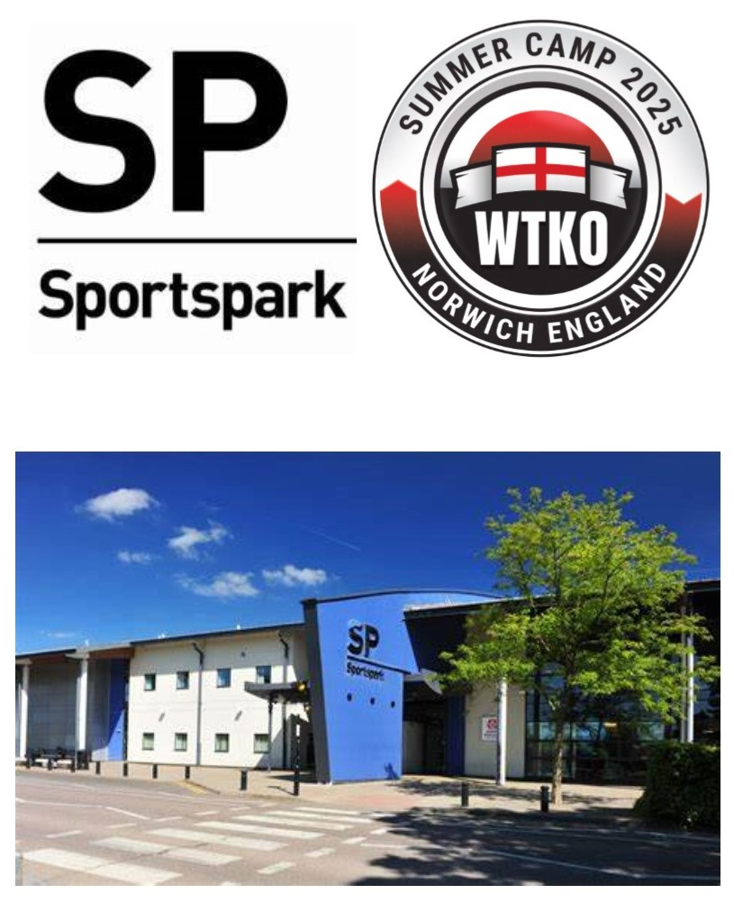

### UEA Sportspark

UEA Sportspark, located on the University of East Anglia (UEA) campus in Norwich, is one of the largest indoor and outdoor sports facilities in the UK. It offers a wide range of activities and top-class amenities, including an Olympic-sized swimming pool, a fully equipped gym, climbing walls, squash courts, athletics tracks, and numerous multi-use sports halls. Whether you're a professional athlete, fitness enthusiast, or just starting your fitness journey, UEA Sportspark provides an inclusive environment for all skill levels. Its vibrant sports community, professional coaching, and variety of programs make it a premier destination for fitness and recreational activities in the region.


