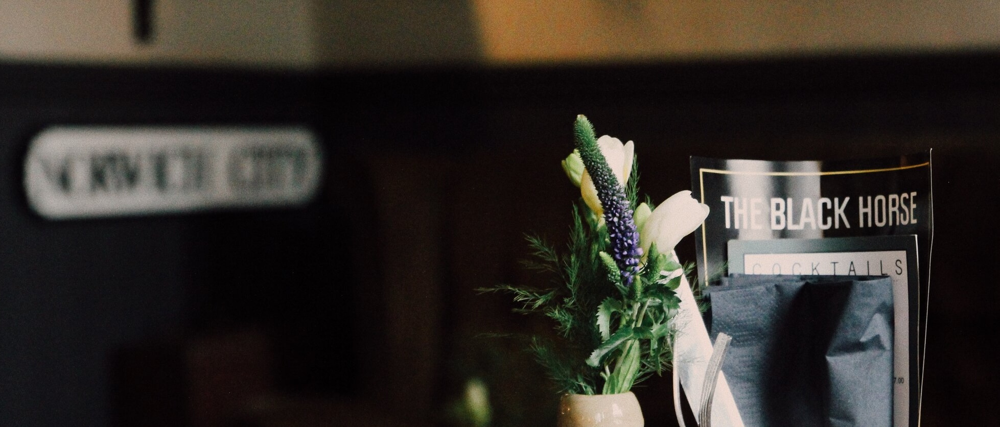
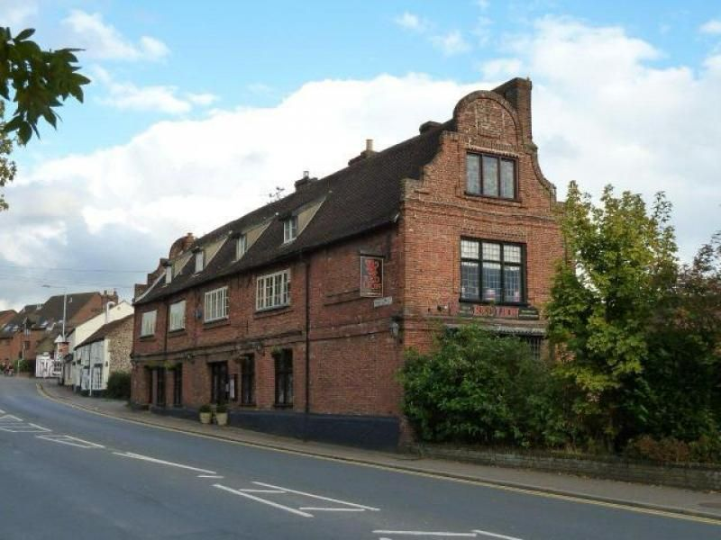

# Recommended Off-Campus Pubs, Restaurants, and Cafes  
**2025 WTKO Summer Camp**

We are delighted to recommend the following establishment for your dining and relaxation needs during your stay in Norwich:

---

## **The Black Horse Public House**  
**Address:** 50 Earlham Road, Norwich, England, NR2 3DE  
**Distance:** 1.9 Miles from UEA  

### **A Brief History**  
The Black Horse has proudly stood for over 300 years in Norwich's Golden Triangle. Built in 1714, it has operated under the same name ever since. The pub's rich history includes a Victorian and Edwardian-era bowling green, now transformed into a sprawling garden adorned with festoon lights, ample seating, a patio area, and outdoor heaters.

### **What to Expect**  
The Black Horse offers:  
- A **relaxed bar area** with craft beers, real ales, cocktails, bottled beers, and fine wines.  
- A **restaurant-style dining area**, ideal for occasions ranging from quiet Sunday roasts to large gatherings.  

### **Contact Information**  
- **Website:** [www.theblackhorse.net](http://www.theblackhorse.net)  
- **Phone:** 01603 630880  
- **Email:** [info@theblackhorsenorwich.com](mailto:info@theblackhorsenorwich.com)  

## Plan Your Visit

- **Location** [📍 Google Maps](https://g.co/kgs/YK9CE9v)  
- **Customer Feedback** [⭐ Tripadvisor Reviews](https://www.tripadvisor.co.uk/Restaurant_Review-g186342-d3835230-Reviews-The_Black_Horse-Norwich_Norfolk_East_Anglia_England.html)

### **Special Offer for WTKO Summer Camp**  
Mention **“WTKO Summer Camp”** when making your booking to enjoy a **15% discount** on all food and drinks.



---

## **The Red Lion Public House - Eaton**  
**Address:** 52 Eaton Street, Norwich, Norfolk, NR4 7LD  
**Distance:** 1.1 Miles from UEA 

The Red Lion Eaton dates back to the 17th century and is one of the finest historic houses in the area. It originally served as a meeting place for men of affairs and influence in the city and for gentry and farmers from the surrounding countryside. Stables at the rear of the property (now guest bedrooms) would have provided shelter for horses while their illustrious owners sampled ale brewed on the premises.

The building, as it essentially survives today, was first built in 1643 by Robert Holmes who was sheriff of Norwich in 1646. It has been described as the finest example of a house of that date in Norwich. It still retains many original character features and in 1954 was accorded Grade II Listed status.

In 1831 Morse and Son amalgamated with Steward, Patteson and Stewards Pockthorpe Brewery to form Steward, Patteson & Co. The "& Co" became "Limited" in 1895 until Watney Mann took over in 1967. The Red Lion now offers a range of ales and guest beers such as Adnams, Courage and Greene King.

### **Contact Information**  
- **Website:** [www.redlion-eaton.co.uk](http://www.redlion-eaton.co.uk)  

---  
Enjoy your visit and experience the charm and hospitality of Norwich!  
