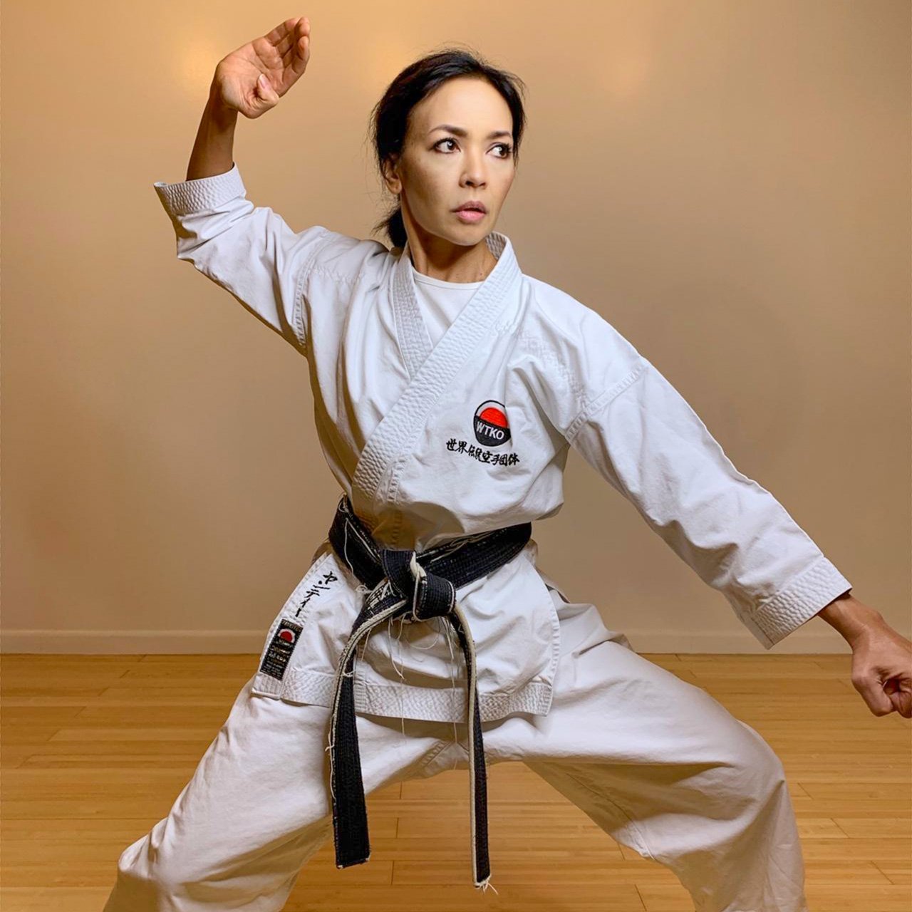

## WTKO WOMAN’S LEADERSHIP GROUP FOUNDER

### Yanti Amos Sensei (4th Dan)

Former lawyer, teacher and wellness industry mentor, Yanti has practiced martial arts she was a teenager and yoga since 2003. When she established her award-winning yoga studioNYC in 2009, she began teaching yoga and meditation and continued to train and instruct Shotokan karate.

She is a global ambassador in the WTKO, the international karate organisation founded by her husband Richard Amos Sensei. In 2020 she founded the WTKO Woman’s Leadership Group.
